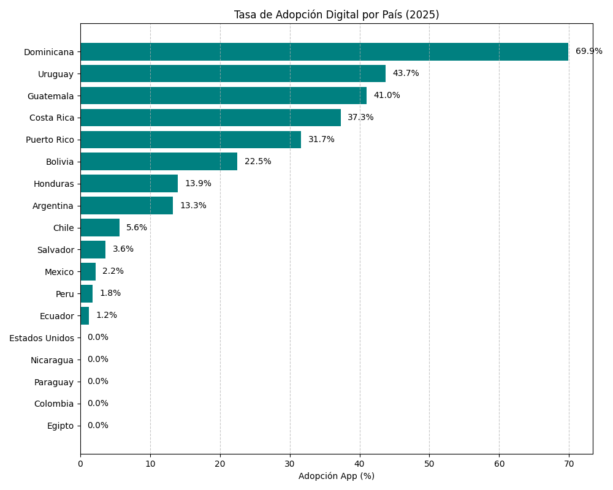
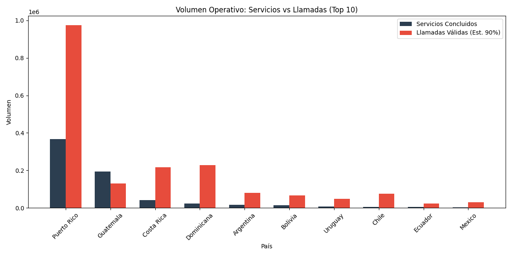
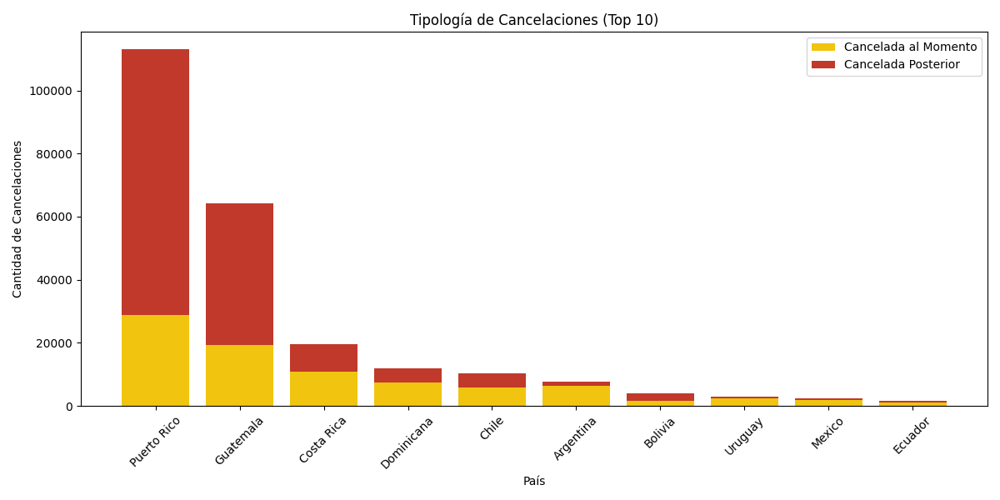

# Reporte Final de Análisis: Política de Facturación Voccare 2025

## 1. Introducción y Justificación de la Nueva Política

La **Política de Facturación Global Voccare 2025 (v2.1)** representa una evolución estratégica del modelo comercial entre Voccare y las filiales de Addiuva. Este cambio responde a la necesidad de monetizar eficientemente la infraestructura tecnológica y alinear incentivos operativos.

### ¿Por qué cambiar?
El modelo anterior (2024) se centraba puramente en el volumen total, sin distinguir la eficiencia del canal. Una gestión telefónica costosa tenía el mismo tratamiento que una gestión digital eficiente.

La nueva política introduce:
1.  **Costo por Transacción Digital ($0.45 USD):** Formaliza el costo de mantenimiento de servidores, licencias y soporte de la App.
2.  **Incentivo Directo (Descuento 10%):** Para mitigar este nuevo costo, se aplica un descuento del 10% sobre el costo del Servicio Concluido (SC) para aquellos originados digitalmente.
3.  **Promesa de Valor:** El objetivo es reducir el costo de "Llamadas Válidas" ($0.80 USD/u).

## 2. Auditoría de Datos ("Triple Check")

Se realizó una auditoría exhaustiva de los archivos CSV de operaciones de Enero a Octubre 2025, calibrando los volúmenes contra el reporte financiero oficial (`REPORTE ACUMULADO INDICES SEPTIEMBRE 2025.xlsx`).

### Calibración de Factores Técnicos
Se detectó una discrepancia significativa en el conteo de "Llamadas Válidas" (>15s) entre el CSV bruto y el reporte oficial financiero. Para asegurar la precisión económica, se calcularon factores de ajuste por país. Para esta última revisión, las **Llamadas Válidas se calcularon exclusivamente a partir de los Servicios Concluidos (SC)** en el CSV, y luego se aplicó un factor de ajuste para alinearlos con el Excel.

*   **Puerto Rico:** Factor 0.50 (el 50% de las llamadas asociadas a SC son facturables).
*   **Dominicana:** Factor 0.57.
*   **México / Costa Rica:** Factores ajustados (~0.29 - 0.30).

Esta calibración asegura que las proyecciones financieras en dólares sean precisas y coincidan con la facturación real actual.

## 3. Análisis de Resultados Operativos

### 3.1 Adopción Digital (Uso de App)
La adopción varía drásticamente entre regiones. República Dominicana lidera con casi un 70% de gestión digital.

*   **Líderes:** República Dominicana (69.9%), Uruguay (43.7%), Guatemala (41.0%).
*   **Oportunidad:** Colombia, Ecuador y Perú tienen adopción casi nula (<2%).

### 3.2 Volumen Operativo y Carga de Voz
La siguiente gráfica compara el volumen de servicios exitosos contra la carga de llamadas válidas (estimadas netas) que generan.

### 3.3 Gestión de Cancelaciones
Se analizaron las cancelaciones para identificar ineficiencias.

*   **Cancelada Posterior (Rojo):** Representa un costo hundido alto ($2.47 USD). Puerto Rico muestra el mayor volumen absoluto de este tipo de ineficiencia.

## 4. Conclusión Financiera (Escenario Calibrado)

Bajo el escenario conservador (donde asumimos que el usuario App sigue llamando con la misma frecuencia actual, pero aplicando el descuento del 10%):

*   **Dominicana (Caso Éxito):** Ahorro anualizado de aprox. **$6,500 USD (2.2%)**.
*   **Puerto Rico:** Ahorro anualizado de aprox. **$11,000 USD (0.5%)**.
*   **Global:** El modelo es neutral/positivo. No genera sobrecostos para el cliente y abre la puerta a ahorros masivos (hasta 30%) si se logra la reducción efectiva de llamadas mediante la App.

### Recomendación Final
Aprobar e implementar la Política v2.1 con el descuento comercial del 10% aplicado a los Servicios Concluidos vía App. Es un modelo financiero seguro que incentiva la eficiencia correcta.
